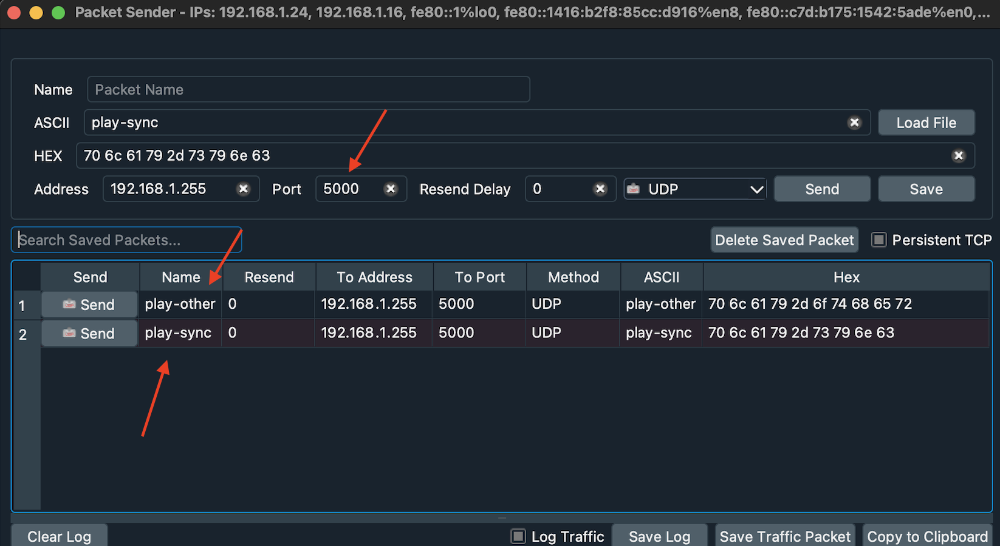

# rlb-html-sync-udp

## How to get started?

1. Install OS 9.0.168 on all your LS5, HD5, XD5 or XT5 players
2. Copy the content of the Master folder to a blank SD card and insert that in the Master player
3. Copy the content of the Slave folder to a blank SD card and insert that in the Slave player
4. Power ON both players

## How to control the displayed content?

To display the synchronized content or non-synchronized content send either the "play-sync" or "play-other" UDP message on port 5000 using the broadcast IP address for your subnet (i.e. the Master player IP address is 192.168.1.12 and the Slave player IP address is 192.168.1.34 then the broacast IP address for that subnet will be 192.168.1.**255** )

Please see the below picture for further details:

